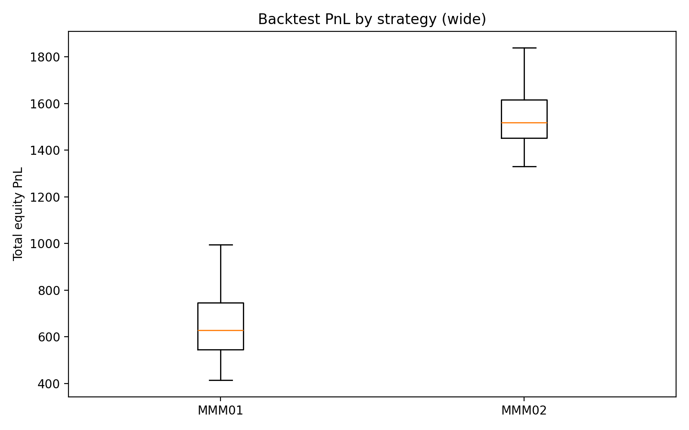
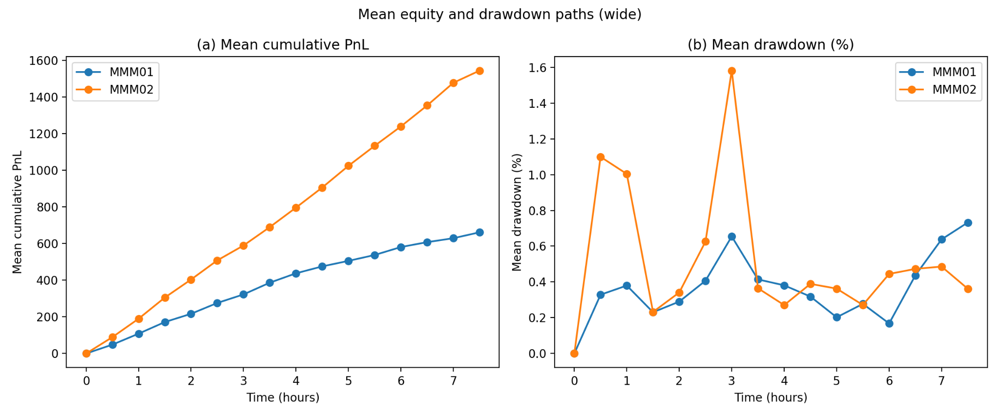
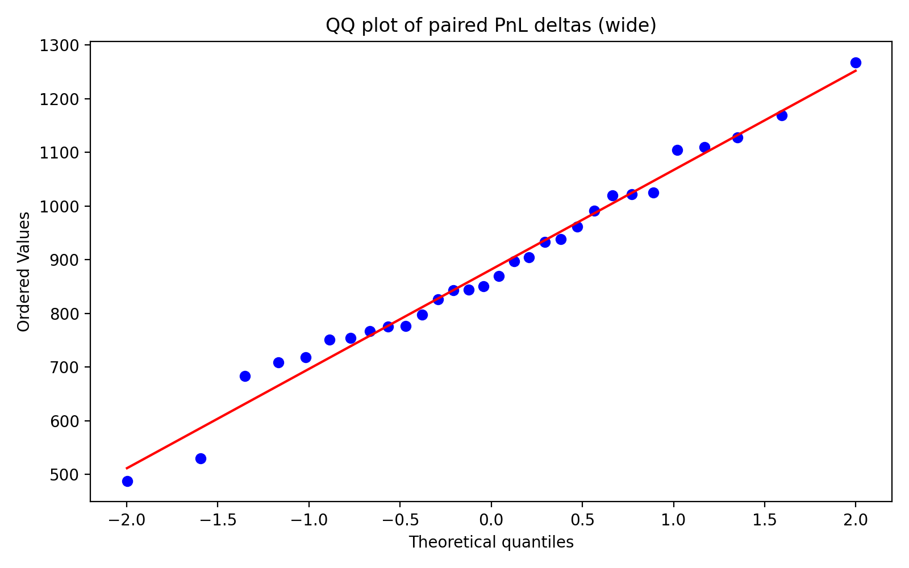
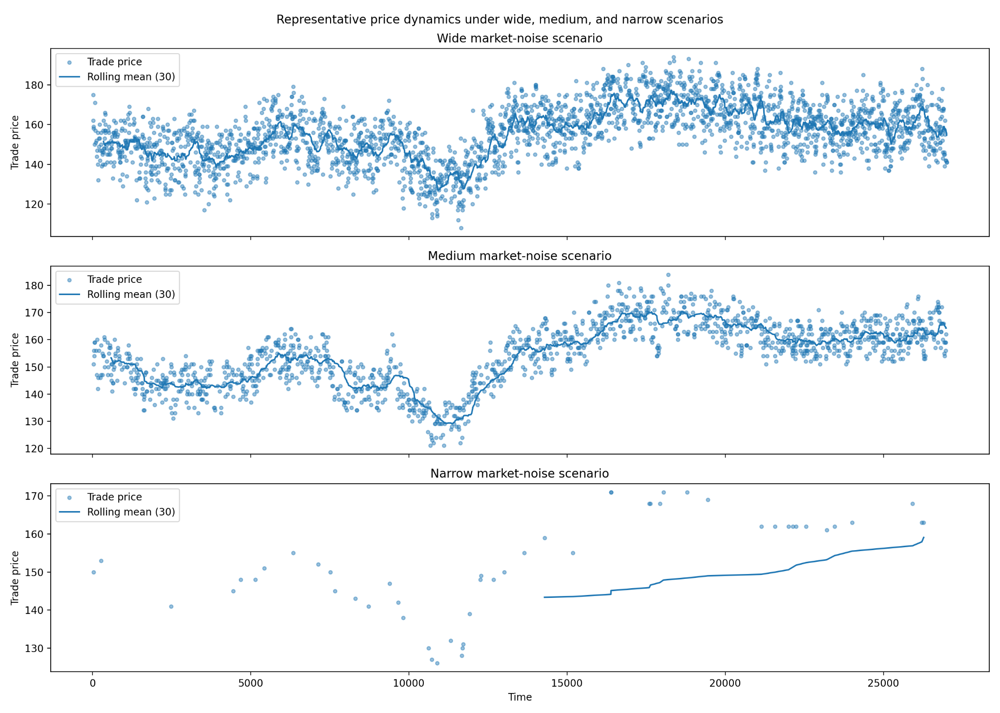

# Algorithmic Trading Market Simulation

## Bollinger-Band Mean-Reversion Strategy in the Bristol Stock Exchange

This project develops and evaluates **MMM02**, an adaptive intraday mean-reversion
market-making strategy implemented in the **Bristol Stock Exchange (BSE)**
limit-order-book simulator.

MMM02 redesigns the benchmark **MMM01** strategy by replacing fixed entry and exit
thresholds with Bollinger Bands computed from recent transaction prices. The strategy
is evaluated through repeated paired simulations using an intraday SPY reference price
path and multiple market-noise regimes.

## Research Question

Can a simple volatility-adaptive Bollinger-band rule improve the performance of a
benchmark intraday mean-reversion market maker while preserving a simple long-only,
single-unit structure?

## Strategy Design

### MMM01 benchmark

MMM01 is a long-only, single-unit market maker using a recent-price reference, a fixed
discount threshold for entry, and a fixed absolute profit target for exit.

### MMM02

Final specification:

- rolling window: **30 trades**
- Bollinger-band multiplier: **1.5**
- inventory: maximum **1 unit**
- direction: **long-only**
- entry: buy when the best ask is below the lower Bollinger band
- normal exit: sell when the best bid is above the upper Bollinger band
- no new position in the final **15 minutes**
- forced liquidation in the final **10 minutes**

## Experimental Design

The market contains 12 buyers, 12 sellers, and one market maker. Background traders
include ZIP, ZIC, SHVR, GVWY, and SNPR agents.

The main result uses **30 paired trials** with seeds 1–30 in the wide-noise regime.
MMM01 and MMM02 are run under the same market configuration and random seed.

Three market-noise regimes are defined:

| Regime | Supply range | Demand range |
|---|---:|---:|
| Wide | (100, 200) | (50, 150) |
| Medium | (115, 185) | (65, 135) |
| Narrow | (125, 175) | (75, 125) |

## Key Results

| Metric | MMM01 | MMM02 | Change |
|---|---:|---:|---:|
| Mean total equity PnL | 661.13 | **1542.97** | **+133.4%** |
| Maximum drawdown | 5.97% | **6.89%** | +0.92 pp |
| Mean roundtrips | 22.70 | **51.80** | **+128.2%** |
| Expectancy | 29.07 | **29.76** | +2.4% |
| Positive end inventory | 33.3% | **0.0%** | -33.3 pp |

MMM02 generated higher simulated PnL in all 30 wide-regime paired trials. The
improvement was driven primarily by a much larger number of completed roundtrips,
rather than a large increase in per-trade expectancy. This came with higher maximum
drawdown.

### PnL distribution



### Cumulative PnL and drawdown



## Statistical Validation

Paired PnL differences were approximately normal in the main wide-noise experiment
(Shapiro-Wilk p = **0.945**). Both the paired t-test and Wilcoxon signed-rank test
reported **p < 0.001** for the MMM02-MMM01 PnL difference.



## Robustness Across Market Regimes



Under medium noise, MMM01 becomes inactive while MMM02 remains active, with mean
PnL of **449.57** and **31.1** mean roundtrips. Under narrow noise, both strategies
become inactive.

## Parameter Selection

A limited grid search was performed over:

- lookback windows: **10, 20, 30**
- band multipliers: **1.5, 2.0, 2.5**
- **5 exploratory trials** per parameter pair
- assumed transaction cost: **1.0 per trade**

The final 30-trade / 1.5 configuration was retained as a balance between profitability,
stability, and net PnL after assumed transaction costs.

## Repository Structure

```text
algorithmic-trading-market-simulation/
├── README.md
├── requirements.txt
├── THIRD_PARTY_NOTICES.md
├── src/
│   ├── bse.py
│   └── market_runner.py
├── experiments/
│   ├── backtest.py
│   └── parameter_sweep.py
├── analysis/
│   └── plot_market_regimes.py
├── data/
│   └── README.md
└── results/
    ├── backtest_pnl_boxplot_wide.png
    ├── backtest_delta_qqplot_wide.png
    ├── backtest_mean_paths_subplot_wide.png
    └── scenario_price_dynamics.png
```

## Installation

Create and activate a virtual environment, then install dependencies:

```bash
python -m venv .venv
source .venv/bin/activate
pip install -r requirements.txt
```

## Data Setup

The original coursework dataset is not included because its redistribution terms have
not yet been verified.

Place a licensed equivalent SPY 1-minute file at:

```text
data/spy_1m_2026-03-03.csv
```

The runner requires at least `datetime` and `close` columns.

## Reproducing the Main Backtest

From the repository root:

```bash
python -m experiments.backtest
```

This runs the final **30 paired MMM01/MMM02 trials in the wide-noise regime**.

## Reproducing the Parameter Sweep

```bash
python -m experiments.parameter_sweep
```

This runs the reported 10/20/30 by 1.5/2.0/2.5 sweep using five seeds in the
wide-noise regime.

## Recreating the Market-Regime Figure

After generating representative tape files for wide, medium, and narrow conditions:

```bash
python -m analysis.plot_market_regimes
```

## Limitations

This is a controlled simulation study, not evidence of live trading profitability.

Key limitations include:

- one intraday SPY reference path;
- a simplified BSE market environment;
- long-only, single-unit inventory;
- stylised transaction-cost assumptions;
- simplified treatment of latency, slippage, and other market frictions.

## Attribution

The simulation engine is based on the **Bristol Stock Exchange (BSE)** developed by
Dave Cliff and contributors. The original MIT license notice is preserved in
`src/bse.py`. See `THIRD_PARTY_NOTICES.md`.

## Portfolio Cleanup Notes

This public-ready version intentionally excludes exploratory branches and abandoned
coursework variants such as MMM02T, momentum/imbalance experiments, no-fee tuning,
duplicate runners, and pre-modification backups.
